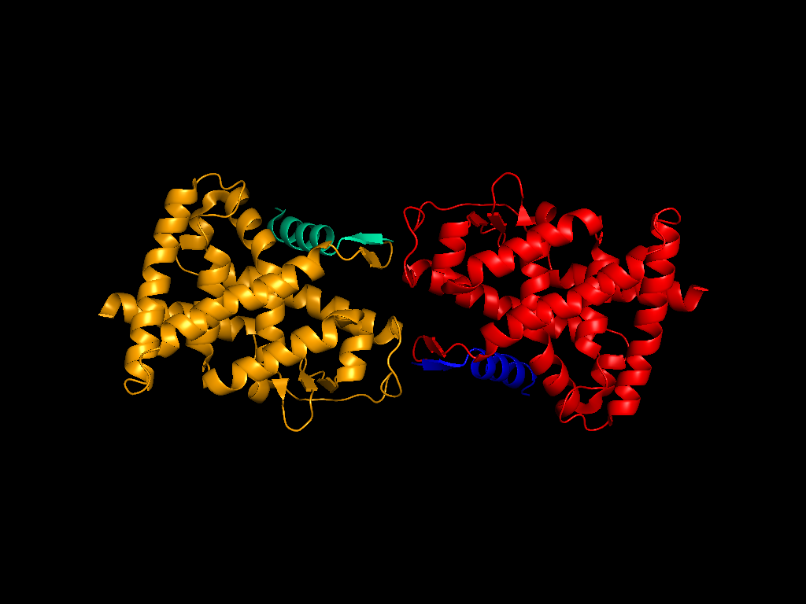
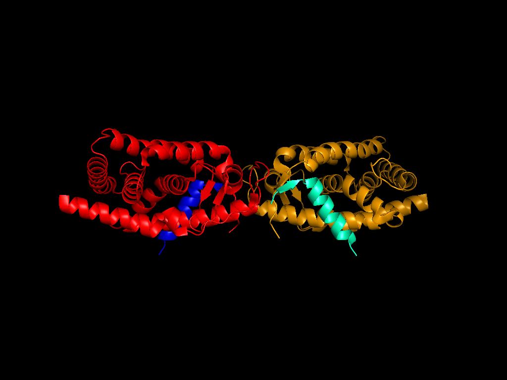
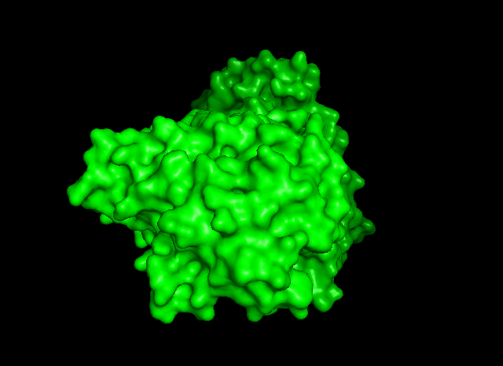
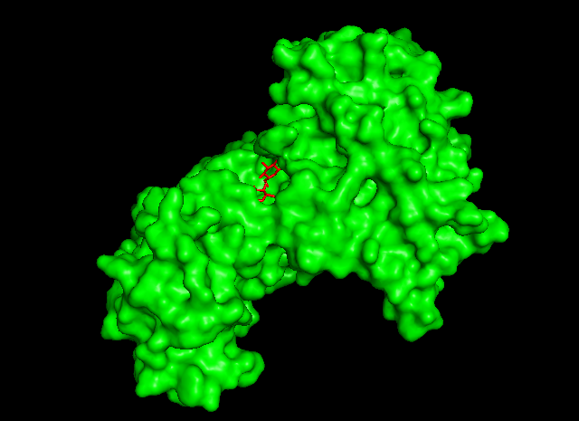

# Viewpoints for Molecular Structres in PyMOL

__This is an experimental branch that requires a patched version of PyMOL (see below)__

This is a collection of python scripts to determine good views of macromolecular structures with PyMOL. 

Currently, the scripts use a random sampling of points on a sphere with fixed radius from the center of mass of a selection to determine a set of candidate viewpoints. Then, the viewpoint with maximal viewpoint entropy is chosen as the 'best' viewpoint. 

## Dependencies

The scripts currently depend on [cgkit light](http://cgkit.sourceforge.net/doc2/introduction.html#cgkit-light) as well as a patched version of PyMOL.

## Installation

1. Patch and recompile PyMOL
2. Clone the repository
```
git clone https://github.com/julianheinrich/viewpoints.git
```
3. Start PyMOL and load the viewpoints script
```
run viewpoints.py
```
4. Load a structure and run 
```
best_view all, residues, 100
```

## Usage

The script currently exposes a single command:

```
best_view(selection='all', by='residues', n=10, width=512, height=512, ray=0, prefix='', add_PCA = False)
```

Best views can be determined by *residues*, secondary structure (*ss*), *atoms*, or *chain*. 

The more samples *n* are specified, the more different camera positions are evaluated and the one with the highest score (currently: the viewpoint entropy) is chosen as the best view.

## Examples
### A simple example that demonstrates the best view based on a selection of chains:

```
run viewpoints.py
fetch 3kmz, async=0
assign_colors chain
orient
```


```
best_view chain C+D, chain, 100, 512, 512
```



### Show me the ligand
```
run viewpoints.py
fetch 2b50, async=0
as surface
color green
as sticks, organic
color red, organic
```

```
best_view organic, atoms, 100, 640, 480
```



