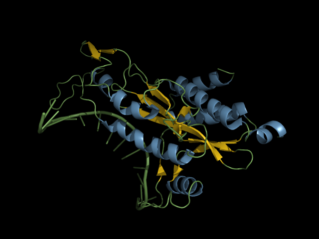
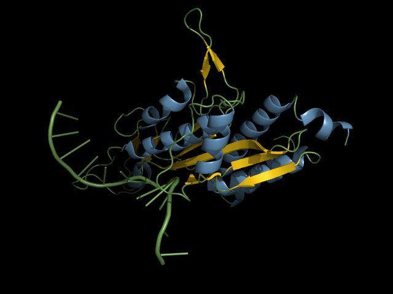
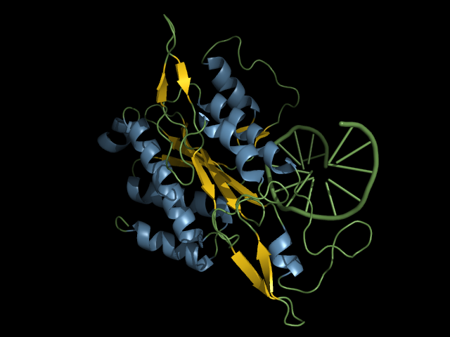
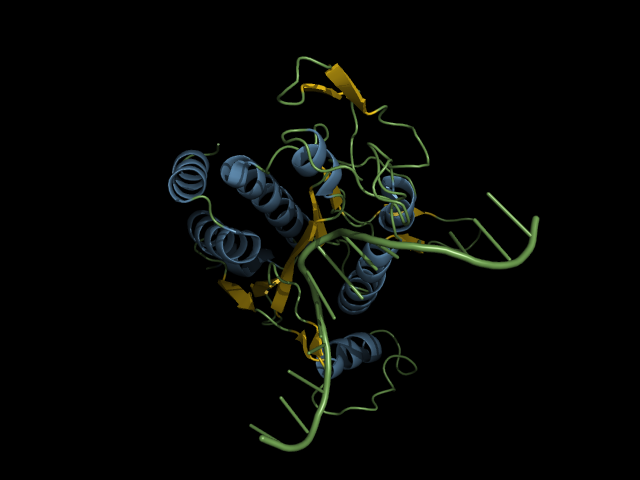

# Automatic Viewpoint Detection for Molecular Structures in PyMOL

This is a plugin for PyMOL to automatically determine good views of macromolecular structures. This is particularly useful to rotate the view to features that are currently hidden from the view, such as small molecules (see the [examples](#Examples)).

Currently, the scripts use a random sampling of points on a sphere with fixed radius from the center of mass of a selection to determine a set of candidate viewpoints. Then, the viewpoint with maximal viewpoint entropy is chosen as the 'best' viewpoint.

If you use this plugin to create figures or animations in PyMOL, please cite:

```
J. Heinrich et al., “Evaluating Viewpoint Entropy for Ribbon Representation of Protein Structure,” Computer Graphics Forum, vol. 35, no. 3, pp. 181–190, 2016.
```
## Quickstart

```
pip install scipy, numpy, scikit-learn
git clone https://github.com/julianheinrich/viewpoints.git
cd viewpoints
pymol -r viewpoints.py
```

## Dependencies

The scripts currently depend on:

* PyMOL version 1.8.4 or above.
* [numpy](http://www.numpy.org/)
* [scipy](https://www.scipy.org/)
* [scikit-learn](http://scikit-learn.org/stable/)


## Installation

1. Make sure all dependencies are fulfilled
2. Clone the repository
```
git clone https://github.com/julianheinrich/viewpoints.git
```
3. Start PyMOL and load the viewpoints script
```
run viewpoints.py
```

## API

```python
def set_best_view(selection='all', by='residues', n=10, width=100, height=100, add_PCA = False, cb = set_best_view_cb):
    """
    Set the best view on a given selection.

    Keyword arguments:
    selection -- a PyMOL selection (default is 'all')
    by -- one of ('atoms', 'residues', 'ss', 'chain')
    n -- the number of samples to evaluate
    width -- the width (in pixels) for each sample
    height -- the height (in pixels) for each sample
    add_PCA -- include (TRUE) PCA viewpoints in addition to the n samples? (default is False)
    cb -- a callback reserved for internal use
    """
```

Best views can be determined by *residues*, secondary structure (*ss*), *atoms*, or *chain*. This parameter determines the level of detail at which entropy is computed. If set to *chain*, a good view will show as much as possible from all chains but doesn't care if individual residues are obscured. If set to *atoms*, each hidden atom will add a penalty to the viewpoint score.

The more samples *n* are specified, the more different camera positions are evaluated and the one with the highest score (currently: the viewpoint entropy) is chosen as the best view. Note that larger *n* results in longer processing times, just as larger image dimensions will.

```python
def orbit(selection='all', by='residues', n=10, width=100, height=100):
    """
    Shows a 360-degree rotation around the selection passing the highest and lowest viewpoint-entropy views.

    Keyword arguments:
    selection -- a PyMOL selection (default is 'all')
    by -- one of ('atoms', 'residues', 'ss', 'chain')
    n -- the number of samples to evaluate
    width -- the width (in pixels) for each sample
    height -- the height (in pixels) for each sample
    """
```

```python
def show_scenes(selection='all', by='residues', n=10, width=100, height=100):
    """
    Computes a set of scenes from clustering viewpoint entropy.

    Keyword arguments:
    selection -- a PyMOL selection (default is 'all')
    by -- one of ('atoms', 'residues', 'ss', 'chain')
    n -- the number of samples to evaluate
    width -- the width (in pixels) for each sample
    height -- the height (in pixels) for each sample
    """
```

```python
def tour(selection='all', by='residues', n=10, width=100, height=100):
    """
    Plays a camera tour passing scenes from clustering viewpoint entropy.

    Keyword arguments:
    selection -- a PyMOL selection (default is 'all')
    by -- one of ('atoms', 'residues', 'ss', 'chain')
    n -- the number of samples to evaluate
    width -- the width (in pixels) for each sample
    height -- the height (in pixels) for each sample
    """
```

## Examples
### A simple example that demonstrates the best view based on a selection of chains:

First, load a structure and orient it:

```
run viewpoints.py
fetch 3kmz, async=0
assign_colors chain
orient
```


Now, set the best view on chains C and D based on evaluating 100 samples with a resolution of 512x512 pixels:

```
set_best_view chain C+D, chain, 100, 512, 512
```


### Show me the ligand

This examples demonstrates how to find a good view on a ligand.
By default, the ligand (in red) is not visible:

```
run viewpoints.py
fetch 2b50, async=0
as surface
color green
as sticks, organic
color red, organic
```


After setting the best view on the ligand, it becomes visible:

```
set_best_view organic, atoms, 100, 640, 480
```


### Animate the transition to the best view as a movie
```
# same as in the previous example
run viewpoints.py
fetch 2b50, async=0
as surface
color green
as sticks, organic
color red, organic

# create an empty 90 frame movie
mset 1 x90
# store the current view as the first frame
frame 1
mview store
# now set the best view for the last frame
frame 90
set_best_view organic, atoms, 100, 640, 480
mview store

# finally, play the movie
mplay
```

### Periodic Orbits
Periodic orbits are camera orbits around a fixed axis, which is determined by the underlying algorithm. The resulting orbit will pass both low and high viewpoint-entropy views for the given selection. This ensures that both the composition of complexes (which often correspond to low-entropy viewpoints) as well as the overall structure (high entropy viewpoints) should be visible during the rotation:
</img>

See [Periodic Orbit Example](examples/2d1s/Readme.md) for details.

### Automatic Tours
Automatic tours compute a set of viewpoints based on clustering the viewpoint entropy over all samples that were taken. The resulting viewpoints are thus different from each other, while each corresponds to a peak in the distribution of viewpoint entropies. Tours can be created either as a set of scenes:
```
fetch 1eri
show_scenes selection=all, by=ss, n=100, width=512, height=512
```
which will result in four viewpoints:
</img>
</img>
</img>
</img>

Alternatively, you can play a movie from the same scenes using
```
tour selection=all, by=ss, n=100, width=512, height=512
```
